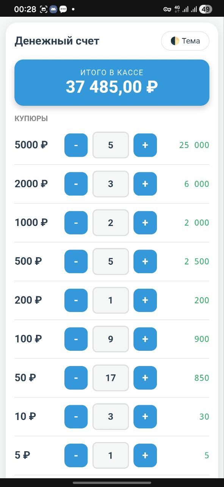
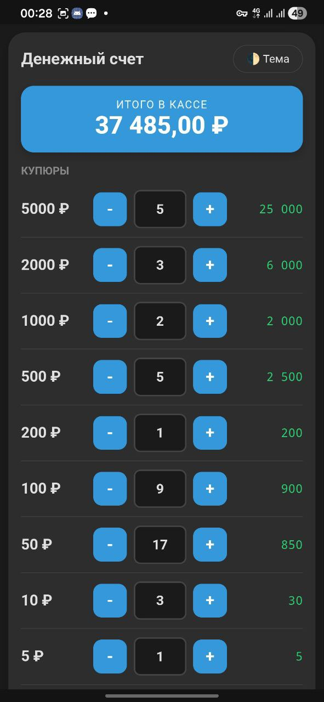
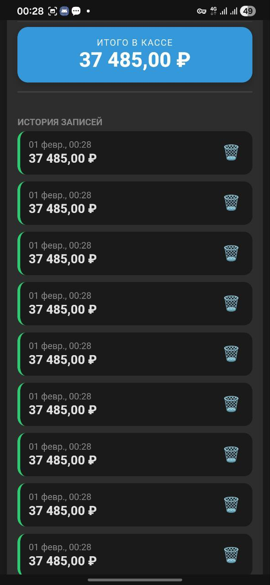
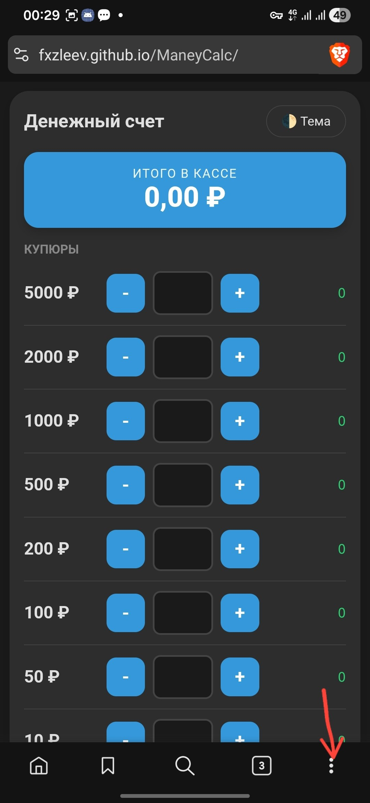
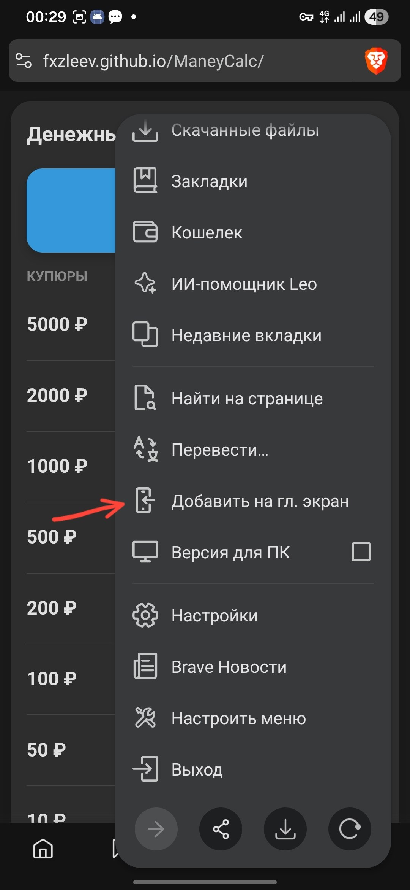
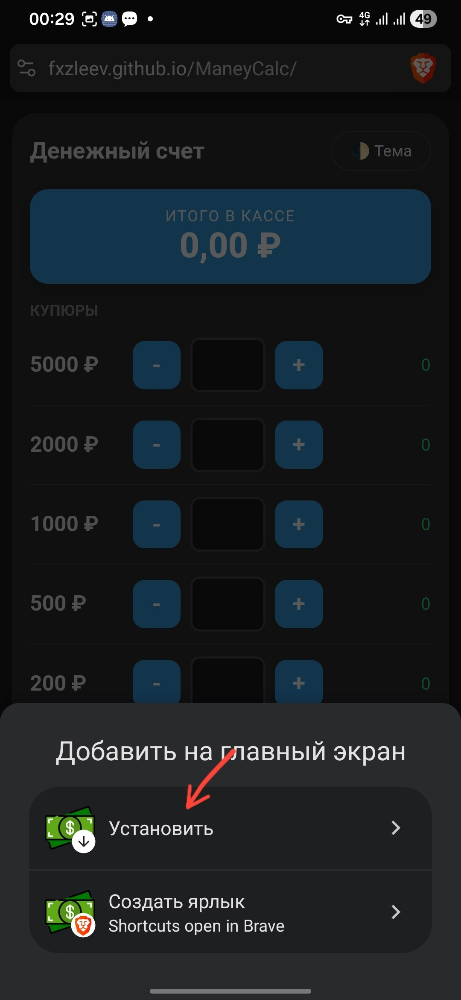
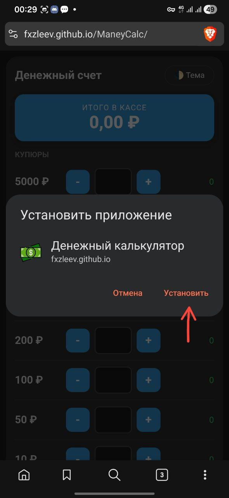
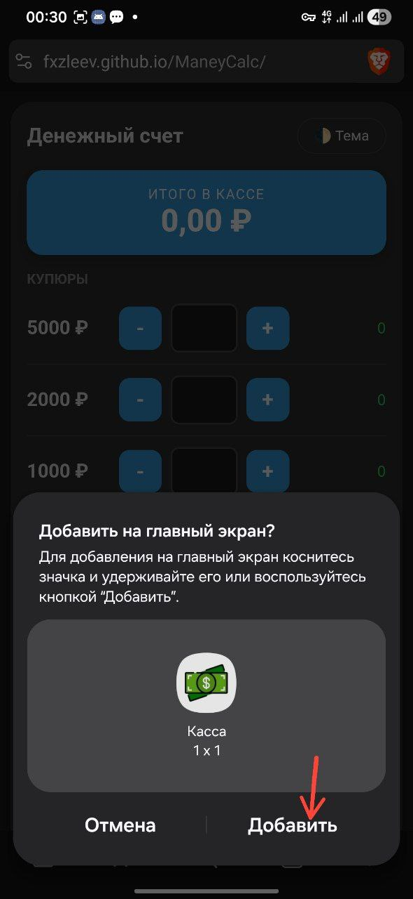
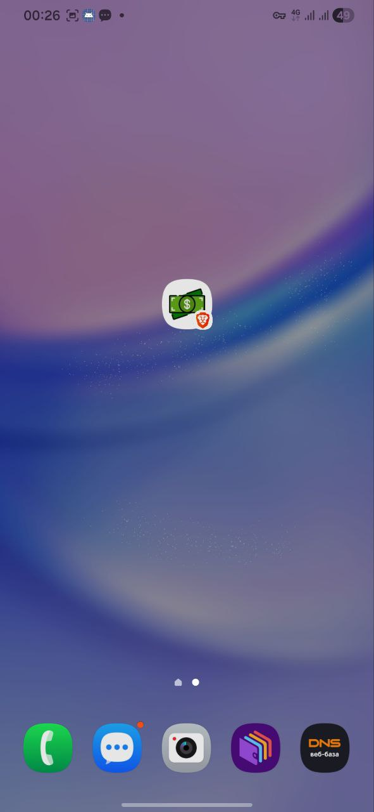

# 💰 Калькулятор Кассы (PWA)

Простое и удобное веб-приложение для быстрого подсчета наличности в кассе в конце смены. Поддерживает купюры и монеты банка РФ.

  
  

  
## ✨ Основные функции
* Быстрый счет: Кнопки + и - для каждого номинала.
* Темная тема: Бережет глаза в конце вечерней смены.
* История: Сохранение итогов смен с датой и временем в память устройства.

* PWA: Можно установить на телефон как обычное приложение.

---

## 📲 Как установить на смартфон (Android/iOS)

Поскольку это Progressive Web App (PWA), его не нужно искать в Play Store или App Store.

### Android (Chrome)
1. Откройте ссылку на проект в браузере <a target="_blank" href="https://fxzleev.github.io/ManeyCalc/">Chrome</a>.
2. Нажмите на три точки (меню) в верхнем правом углу.

3. Выберите пункт "Добавить на главный экран" или "Установить приложение".

  
  
  
  
  

4. Теперь калькулятор доступен на рабочем столе с иконкой.

### iOS (Safari)
1. Откройте ссылку в браузере <a target="_blank" href="https://fxzleev.github.io/ManeyCalc/">Safari</a>.
2. Нажмите кнопку "Поделиться" (квадрат со стрелкой вверх).
3. Прокрутите меню вниз и выберите "На экран «Домой»".

---

## 🛠 Технологии
* HTML5 / CSS3 (Flexbox, CSS Variables)
* JavaScript (LocalStorage API)
* Manifest.json (для поддержки PWA)
